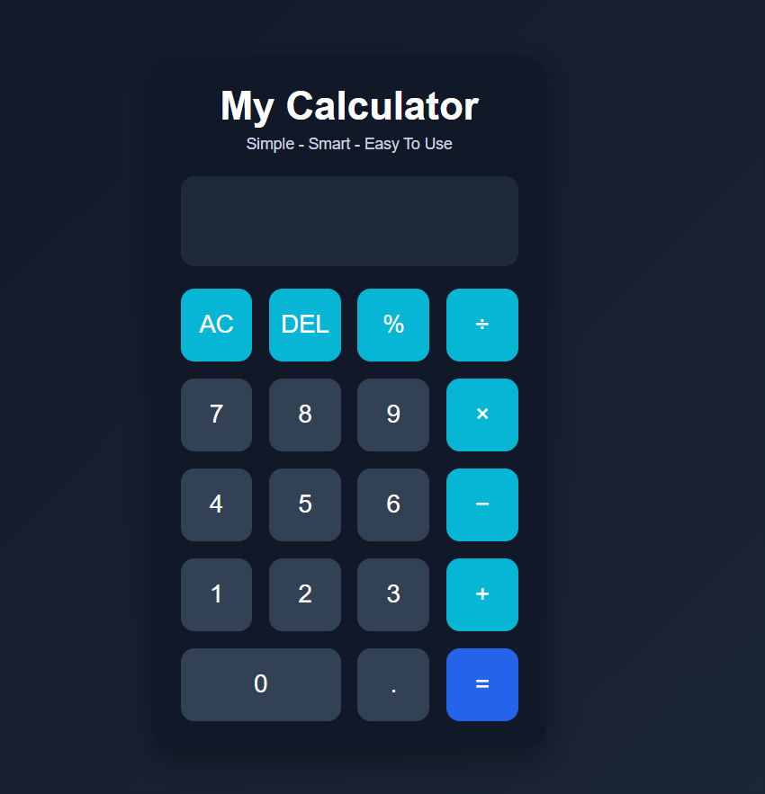

# 🌐 CODSOFT Web Development Internship

This repository contains all the projects completed during my **CodSoft Web Development Internship** using **HTML, CSS, and JavaScript**.

The projects focus on responsive web design, frontend development, user interface creation, and JavaScript functionality.

---

# 📌 Projects Included

## 1️⃣ Portfolio Website

A personal portfolio website designed to showcase my:

- Skills
- Projects
- Resume
- Certifications
- Contact Information

### ✨ Features

- Responsive Design
- About Me Section
- Skills Showcase
- Projects Section
- Certificates Section
- Resume Download Option
- Contact Section

### 🛠️ Technologies Used

- HTML5
- CSS3
- JavaScript

### 📸 Output


---

## 2️⃣ Landing Page

A modern AI-themed landing page with attractive UI and responsive layout.

### ✨ Features

- Modern User Interface
- Responsive Layout
- Hero Section
- Navigation Bar
- Interactive Design

### 🛠️ Technologies Used

- HTML5
- CSS3
- JavaScript

### 📸 Output


---

## 3️⃣ Calculator Web App

A responsive calculator capable of performing basic arithmetic operations.

### ✨ Features

- Addition
- Subtraction
- Multiplication
- Division
- Responsive Design
- Interactive UI

### 🛠️ Technologies Used

- HTML5
- CSS3
- JavaScript

### 📸 Output



---

# 🚀 How to Run the Projects

1. Clone or download this repository

```bash
git clone https://github.com/yourusername/CODSOFT-Web-Development.git
```

2. Open the project folder

3. Run `index.html` in your browser

---

# 📂 Folder Structure

```bash
CODSOFT-Web-Development/
│
├── Portfolio/
│   ├── index.html
│   ├── style.css
│   ├── script.js
│   ├── README.md
│   └── portfolio-output.png
│
├── LandingPage/
│   ├── index.html
│   ├── style.css
│   ├── script.js
│   ├── README.md
│   └── landingpage-output.png
│
├── Calculator/
│   ├── index.html
│   ├── style.css
│   ├── script.js
│   ├── README.md
│   └── calculator-output.png
│
└── README.md
```

---

# 🎯 Internship Objective

The objective of these projects was to improve my frontend development skills and gain practical experience in building responsive and interactive web applications.

---

# 👩‍💻 Author

## Priyanshi Jain

Frontend Development Intern at CodSoft

---

# 🌐 Connect With Me

- GitHub: https:https://github.com/Priyanshi-jain-25
- LinkedIn: https://www.linkedin.com/in/priyanshi-jain-5285563a7/

---

# ⭐ Acknowledgement

Special thanks to **CodSoft** for providing this amazing internship opportunity and helping me enhance my web development skills.
